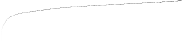

[](https://gitter.im/emc-mongoose)
[](https://mongoose-issues.atlassian.net/projects/KAFKA)
[](https://travis-ci.org/emc-mongoose/mongoose-storage-driver-kafka/builds)
[](http://central.maven.org/maven2/com/github/emc-mongoose/mongoose-storage-driver-kafka)
[](https://hub.docker.com/r/emcmongoose/mongoose-storage-driver-kafka/)

# Content

1. [Introduction](#1-introduction)<br/>
2. [Features](#2-features)<br/>
3. [Deployment](#3-deployment)<br/>
&nbsp;&nbsp;3.1. [Basic](#31-basic)<br/>
&nbsp;&nbsp;3.2. [Docker](#32-docker)<br/>
&nbsp;&nbsp;&nbsp;&nbsp;3.2.1. [Standalone](#321-standalone)<br/>
&nbsp;&nbsp;&nbsp;&nbsp;3.2.2. [Distributed](#322-distributed)<br/>
&nbsp;&nbsp;&nbsp;&nbsp;&nbsp;&nbsp;3.2.2.1. [Additional Node](#3221-additional-node)<br/>
&nbsp;&nbsp;&nbsp;&nbsp;&nbsp;&nbsp;3.2.2.2. [Entry Node](#3222-entry-node)<br/>
4. [Configuration](#4-configuration)<br/>
&nbsp;&nbsp;4.1. [Specific Options](#41-specific-options)<br/>
&nbsp;&nbsp;4.2. [Tuning](#42-tuning)<br/>
&nbsp;&nbsp;&nbsp;&nbsp;4.2.1. [Concurrency](#421-concurrency)<br/>
&nbsp;&nbsp;&nbsp;&nbsp;4.2.2. [Inherited Storage Driver Usage Warnings](#422-inherited-storage-driver-usage-warnings)<br/>
5. [Usage](#5-usage)<br/>
&nbsp;&nbsp;5.1. [Record Operations](#51-record-operations)<br/>
&nbsp;&nbsp;&nbsp;&nbsp;5.1.1. [Create](#511-create)<br/>
&nbsp;&nbsp;&nbsp;&nbsp;5.1.2. [Read](#512-read)<br/>
&nbsp;&nbsp;&nbsp;&nbsp;5.1.3. [Update](#513-update)<br/>
&nbsp;&nbsp;&nbsp;&nbsp;5.1.4. [Delete](#514-delete)<br/>
&nbsp;&nbsp;&nbsp;&nbsp;5.1.5. [List](#515-list)<br/>
&nbsp;&nbsp;&nbsp;&nbsp;5.1.6. [End-to-end Latency](#516-end-to-end-latency)<br/>
&nbsp;&nbsp;5.2. [Topic Operations](#52-topic-operations)<br/>
&nbsp;&nbsp;&nbsp;&nbsp;5.2.1. [Create](#521-create)<br/>
&nbsp;&nbsp;&nbsp;&nbsp;5.2.2. [Read](#522-read)<br/>
&nbsp;&nbsp;&nbsp;&nbsp;5.2.3. [Update](#523-update)<br/>
&nbsp;&nbsp;&nbsp;&nbsp;5.2.4. [Delete](#524-delete)<br/>
&nbsp;&nbsp;&nbsp;&nbsp;5.2.5. [List](#525-list)<br/>
&nbsp;&nbsp;5.3. [Custom Kafka Headers](#53-custom-kafka-headers)<br/>
&nbsp;&nbsp;&nbsp;&nbsp;5.3.1. [Expressions](#531-expressions)<br/>
6. [Performance](#6-performance)<br/>
&nbsp;&nbsp;6.1. [Compariosn of Mongoose Kafka Storage Driver and Kafka Benchmark](#61-comparison-of-mongoose-kafka-storage-driver-and-kafka-benchmark)<br/>
&nbsp;&nbsp;&nbsp;&nbsp;6.1.1. [Records Creating](#611-records-creating)<br/>
7. [Open Issues](#7-open-issues)<br/>
8. [Development](#8-development)<br/>
&nbsp;&nbsp;8.1. [Build](#81-build)<br/>
&nbsp;&nbsp;8.2. [Test](#82-test)<br/>
&nbsp;&nbsp;&nbsp;&nbsp;8.2.1. [Manual](#821-manual)<br/>
&nbsp;&nbsp;&nbsp;&nbsp;8.2.2. [Automated](#822-automated)<br/>
&nbsp;&nbsp;&nbsp;&nbsp;&nbsp;&nbsp;8.2.2.1. [Unit](#8221-unit)<br/>
&nbsp;&nbsp;&nbsp;&nbsp;&nbsp;&nbsp;8.2.2.2. [Integration](#8222-integration)<br/>
&nbsp;&nbsp;&nbsp;&nbsp;&nbsp;&nbsp;8.2.2.3. [Functional](#8223-functional)<br/>

# 1. Introduction

Mongoose and Kafka are using quite different concepts. So it's necessary to determine how
[Kafka-specific terms](https://kafka.apache.org/intro) are mapped to the
[Mongoose abstractions]((https://gitlab.com/emcmongoose/mongoose/tree/master/doc/design/architecture#1-basic-terms)).

| Kafka | Mongoose |
|---------|----------|
| Record | *Data Item* |
| Topic | *Path Item* |
| Partition | N/A |

# 2. Features
+ Item types:
  * `data item` - Record/Message
  * `path` - Topic
+ Data item operation types:
  * `create`
  * `read`
+ Path item operation types:
  * `create`
  * `read`
  * `delete`
  * `list`
+ Storage specific:
  * Records' keys
  * Compression type for producer's data

# 3. Deployment

## 3.1. Basic

Java 11+ is required to build/run.

1. Get the latest `mongoose-base` jar from the 
[maven repo](http://repo.maven.apache.org/maven2/com/github/emc-mongoose/mongoose-base/)
and put it to your working directory. Note the particular version, which is referred as *BASE_VERSION* below.

2. Get the latest `mongoose-storage-driver-preempt` jar from the
[maven repo](http://repo.maven.apache.org/maven2/com/github/emc-mongoose/mongoose-storage-driver-preempt/)
and put it to the `~/.mongoose/<BASE_VERSION>/ext` directory.

3. Get the latest `mongoose-storage-driver-kafka` jar from the
[maven repo](http://repo.maven.apache.org/maven2/com/github/emc-mongoose/mongoose-storage-driver-kafka/)
and put it to the `~/.mongoose/<BASE_VERSION>/ext` directory.

```bash
java -jar mongoose-base-<BASE_VERSION>.jar \
    --storage-driver-type=kafka \
    --storage-net-node-addrs=<NODE_IP_ADDRS> \
    --storage-net-node-port=9092 \
    --storage-driver-create-key-enabled=false \
    --storage-driver-compression-type=none \
    --item-data-size=1KB \
    ...
```

## 3.2. Docker

### 3.2.1. Standalone

```bash
docker run \
    --network host \
    emcmongoose/mongoose-storage-driver-kafka \
    --storage-net-node-addrs=<NODE_IP_ADDRS> \
    --storage-driver-create-key-enabled=false \
    --storage-driver-compression-type=none \
    ...
```

### 3.2.2. Distributed

#### 3.2.2.1. Additional Node

```bash
docker run \
    --network host \
    --expose 1099 \
    emcmongoose/mongoose-storage-driver-kafka \
    --run-node
```

#### 3.2.2.2. Entry Node

```bash
docker run \
    --network host \
    emcmongoose/mongoose-storage-driver-kafka \
    --load-step-node-addrs=<ADDR1,ADDR2,...> \
    --storage-net-node-addrs=<NODE_IP_ADDRS> \
    --storage-driver-create-key-enabled=false \
    --storage-driver-compression-type=none \
```

# 4. Configuration

## 4.1. Specific Options

| Name | Type | Default Value | Description |
|---------|----------|----------|----------|
| storage-driver-record-timeoutMillis | long | 10000 | The event read and create timeout in milliseconds |
| storage-driver-create-key-enabled | boolean | false | Creates a record with or without a key |
| storage-net-sndBuf | integer | 131072 | The size of the TCP send buffer to use when sending data. If the value is -1, the OS default will be used. |
| storage-net-rcvBuf | integer | 32768 | The size of the TCP receive buffer to use when reading data. If the value is -1, the OS default will be used. |
| storage-driver-request-size | integer | 1048576 | The maximum size of a request in bytes. This setting will limit the number of record batches the producer will send in a single request to avoid sending huge requests. |
| storage-net-linger | integer | 0 | The delay before sending the records. This setting gives the upper bound on the delay for batching: once we get *batch.size* worth of records for a partition it will be sent immediately regardless of this setting, however if we have fewer than this many bytes accumulated for this partition we will 'linger' for the specified time waiting for more records to show up. |
| storage-driver-buffer-memory | long | 33554432 | The total bytes of memory the producer can use to buffer records waiting to be sent to the server. |
| storage-driver-compression-type | string | none | The compression type for all data generated by the producer. The default is none (i.e. no compression). Valid values are none, gzip, snappy, lz4, or zstd.  |
| storage-net-node-addrs | list | "" | A list of host/port pairs to use for establishing the initial connection to the Kafka cluster.  This list should be in the form *host1:port1*,*host2:port2* |
| storage-net-node-port | integer | 9092 | The common port number to access the storage nodes, may be overriden adding the port number to the storage-driver-addrs, for example: "127.0.0.1:9020,127.0.0.1:9022,..." |

## 4.2. Tuning

### 4.2.1. Concurrency

There are two configuration options controlling the load operations concurrency level.

* `storage-driver-limit-concurrency`
Limits the count of the active load operations at any moment of the time. The best practice is to set it to 0 (unlimited
concurrency for the asynchronous operations, aka the *top gear of the "burst mode"*).

* `storage-driver-threads`
The count of the threads running/submitting the load operations execution. The meaningful values are usually only few
times more than the count of the available CPU threads.

### 4.2.2. Inherited Storage Driver Usage Warnings

See the [design notes](https://github.com/emc-mongoose/mongoose-storage-driver-preempt#design)

# 5. Usage

## 5.1. Record Operations

Mongoose should perform the load operations on the *records* when the configuration option `item-type` is set to `data`.

### 5.1.1. Create
`ProducerApi` has a `KafkaProducer` class with function  [send()](http://kafka.apache.org/21/javadoc/org/apache/kafka/clients/producer/KafkaProducer.html#send-org.apache.kafka.clients.producer.ProducerRecord-org.apache.kafka.clients.producer.Callback-), which can send a record to topic.
* Steps:

**Note:**
> KafkaProducer contains thread, the number of threads is equal to the number of producers.

### 5.1.2. Read
`ConsumerApi` has a `KafkaConsumer` class, provided with function [poll()](https://kafka.apache.org/10/javadoc/org/apache/kafka/clients/consumer/Consumer.html#poll-long-). According to Kafka documentation, on each poll Consumer  begins to consume records from last offset.
* Steps:

**Note:**
> num.consumer.fetchers	— the number fetcher threads used to fetch data, default value = 1.

### 5.1.3. Update
Not supported. 

### 5.1.4. Delete
[deleteRecords()](http://kafka.apache.org/21/javadoc/org/apache/kafka/clients/admin/AdminClient.html#deleteRecords-java.util.Map-org.apache.kafka.clients.admin.DeleteRecordsOptions-) function from AdminClient(AdminClient API) class, deletes all records before the one with giving offset.

### 5.1.5. List
Not supported.

### 5.1.6. End-to-end Latency

The end-to-end latency is a time span between the CREATE and READ operations executed for the same item. The end-to-end 
latency may be measured using Mongoose's 
[Pipeline Load extension](https://github.com/emc-mongoose/mongoose-load-step-pipeline) which is included into this 
extension's docker image. To do this, it's necessary to produce the raw operations trace data.

Scenario example:
<https://github.com/emc-mongoose/mongoose-storage-driver-pravega/blob/master/src/test/robot/api/storage/data/e2e_latency.js>

Command line example:
```bash
docker run \
    --network host \
    --volume "$(pwd)"/src/test/robot/api/storage/data:/root \
    --volume /tmp/log:/root/.mongoose/<BASE_VERSION>/log \
    emcmongoose/mongoose-storage-driver-kafka \
    --item-output-path=topic1 \
    --run-scenario=/root/e2e_latency.js \
    --load-step-id=e2e_latency \
    --item-data-size=10KB \
    --load-op-limit-count=100000 \
    --output-metrics-trace-persist
```

Once the raw operations trace data is obtained, it may be used to produce the end-to-end latency data using the tool:
<https://github.com/emc-mongoose/e2e-latency-generator>

#### 5.1.6.1 Results 

Scenario example e2e_latency.js:

```javascript
var topic = "topic"

var sharedConfig = {
    "storage": {
        "driver": {
            "type": "kafka"
        }
    },
    "output": {
        "metrics": {
	    "trace": {
	        "persist": true
            }
        }
    },
    "load": {
        "op": {
	    "limit": {
	        "recycle": 1000
	    }
        }
    }
};

var createConfig = {
    "item" : {
        "type" : "data",
        "output" : {
            "path" : topic
        }
    },
    "load" : {
        "op" : {
            "limit" : {
                "count" : 1000000
            }
        }
    }
};

var readConfig = {
    "item" : {
        "type" : "data",
        "input" : {
            "path" : topic
        }
    },
    "load" : {
        "op" : {
            "type" : "read",
            "limit" : {
                "count" : 1000000
            },
            "recycle" : true
        }
    }
};

PipelineLoad
	.config(sharedConfig)
	.append(createConfig)
	.append(readConfig)
	.run()

```

Command line example:

```bash
java -jar mongoose-base-<BASE_VERSION>.jar \
    --storage-driver-type=kafka \
    --storage-net-node-port=<NODE_IP_ADDRS> \
    --run-scenario=e2e_latency.js \
    --item-data-size=1 \
    --load-step-id=e2e_latency_test
```

Results:

```
 topic/h7r9j6cz0mtk,0,24783469
 topic/z0zoqp868v75,39948230,27580282
 topic/tlp1bns9jc7p,40276731,29334974
 topic/6txhtx4ljv5,40471469,31805473
 topic/oxcouyv1dycw,40510647,32548057
 topic/gohqxf7oafbp,40635783,33145122
 topic/g6auzxpfz4id,40708983,33710917
 topic/azdtimn0292s,40824477,34392279
 topic/m9iflaa0ezrf,40845198,34853497
 topic/r9etwfl5is4,40865059,35485910
 ...
 topic/t54d9deejguy,2954340782,30107011025
 topic/16vhzvhw11sp,2954341641,30107029774
 topic/nyjq2l2uk1kd,2954342243,30107050436
 topic/oh7zv7sii4nd,2954342925,30107081205
 topic/7eqxrpt20pa1,2954343556,30107102342
 topic/gl1w13xmz1v,2954344453,30107120725
 topic/2k9i0cdxglpf,2954345143,30107141259
 topic/iuswkxqxeorx,2954345930,30107164887
 topic/suy5gu6ajf4n,2954346629,30107250413
 topic/8b7s40r29iel,2954348924,30107249488

```
Each record has has the following columns:

1) Item path 
2) Item writing start time offset in microseconds 
3) The calculated end-to-end latency

In this chart above, the min latency value is 24 783 469 μs, max is 30 107 249 488 μs. 
The ratio between max and min is ~ 30 082 466 019. 

Heatmap Output:



Y axis is logarithmic between the detected latency value min and max. By default it's height is 100 px and corresponding 100 rows.
X axis is linear. By default it's width is the count of pixels equal max timestamp minus min. 

## 5.2. Topic Operations

Mongoose should perform the load operations on the *topic* when the configuration option `item-type` is set to `path`.
Apache Kafka has `AdminClient Api`, which provides function for managing and inspecting topics. 

### 5.2.1. Create
[createTopics()](http://kafka.apache.org/21/javadoc/org/apache/kafka/clients/admin/AdminClient.html#createTopics-java.util.Collection-) creates a batch of new topics.
* Steps:
```
java -jar mongoose-base-4.2.11.jar \
    --storage-driver-type=kafka \
    --storage-net-node-addrs=127.0.0.1 \
    --storage-net-node-port=9092 \
    --item-type=path \
    --load-op-limit-count=100 \
    --storage-driver-limit-concurrency=100 \
```
This example creates 100 simple topics. Each topic has one partition and replication factor of one. 

**Note:**
> storage-driver-limit-concurrency must equal to load-batch-size because of concurrencyTrottle.acquire(batchSize).

### 5.2.2. Read
Mongoose's implementation of a topic reading reads the whole topic in one operation. This is achieved by
invocation of the poll method for each topic until it'll return an empty record collection. If collection is empty, mark
the topic as read.

The read operation marks as failed when an exception occurs. According to Kafka docs the poll() method throws 
[exceptions](https://kafka.apache.org/22/javadoc/org/apache/kafka/clients/consumer/KafkaConsumer.html#poll-java.time.Duration-).

* Steps:
```
java -jar mongoose-base-4.2.11.jar \
    --storage-driver-type=kafka \
    --storage-net-node-addrs=127.0.0.1 \
    --storage-net-node-port=9092 \
    --item-data-size=1 \
    --run-scenario=readTopicsLoad.js \
```

Using scenario:
```javascript
PreconditionLoad
	.config({
		"item" : {
			"type" : "data",
			"output" : {
				"path" : "topic1"
			}
		},
		"load" : {
			"op" : {
				"limit" : {
					"count" : 5
				}
			}
		}
	})
	.run();

PreconditionLoad
	.config({
		"item" : {
			"type" : "data",
			"output" : {
				"path" : "topic2"
			}
		},
		"load" : {
			"op" : {
				"limit" : {
					"count" : 5
				}
			}
		}
	})
	.run();

var topic_list_file = "topic_list.csv"

ReadLoad
	.config({
		"item" : {
			"type" : "path",
			"input" : {
				"file" : topic_list_file
			}
		},
		"load" : {
			"op" : {
				"limit" : {
					"count" : 2
				},
				"recycle" : true
			}
		}
	})
	.run();
```

This example creates two topics and writes 5 records to both of them. Then it reads each topic as a Path operation.

**Note:**
> KafkaConsumer raises no exceptions when the user subscribes and polls to the topic which doesn't exist. 
> So that operation will mark as SUCCESSFUL. See Transfer Size to deal with it.

### 5.2.3. Update
Not supported

### 5.2.4. Delete
[deleteTopics()](http://kafka.apache.org/21/javadoc/org/apache/kafka/clients/admin/AdminClient.html#deleteTopics-java.util.Collection-) deletes a batch of topics.
* Steps:

### 5.2.5. List
[listTopics()](http://kafka.apache.org/21/javadoc/org/apache/kafka/clients/admin/AdminClient.html#listTopics--) returns list of topics
* Steps:

## 5.3. Custom Kafka Headers

Scenario example:

```javascript
var customKafkaHeadersConfig = {
    "storage" : {
        "driver" : {
            "create" : {
                "headers" : {
                    "header-name-0" : "header_value_0",
                    "header-name-1" : "header_value_1",
                    // ...
                    "header-name-N" : "header_value_N"
                }
            }
        }
    }
};
Load
    .config(customKafkaHeadersConfig)
    .run();
```

**Note**:
> Don't use the command line arguments for the custom Kafka headers setting.

### 5.3.1. Expressions

Scenario example, note both the parameterized header name and value:
```javascript
var varKafkaHeadersConfig = {
    "storage" : {
        "driver" : {
            "create" : {
                "headers" : {
                    "x-amz-meta-${math:random(30) + 1}" : "${date:format("yyyy-MM-dd'T'HH:mm:ssZ").format(date:from(rnd.nextLong(time:millisSinceEpoch())))}"
                }
            }
        }
    }
};
Load
    .config(varKafkaHeadersConfig)
    .run();
```
# 6. Performance

## 6.1. Comparison of Mongoose Kafka Storage Driver and Kafka Benchmark

### 6.1.1. Records Creating

**Note about KAFKA benchmark:**
> Set KAFKA_HEAP_OPTS="-Xmx1024M" in kafka-run-class.sh 

Command line example of KAFKA benchmark:
```
./bin/kafka-run-class.sh \
org.apache.kafka.tools.ProducerPerformance --throughput=-1 \
--topic=test-one \
--num-records=2000000 \
--record-size=1 \
--producer-props bootstrap.servers=localhost:9092 \
buffer.memory=33554432 \
batch.size=200

```
Result:
```
2000000 records sent, 
16953.750170 records/sec (0.02 MB/sec), 
58455.55 ms avg latency, 
80970.00 ms max latency, 
57215 ms 50th, 
79765 ms 95th, 
80630 ms 99th, 
80933 ms 99.9th.
```

Command line example of KAFKA storage driver:
```
docker run --network host \
emcmongoose/mongoose-storage-driver-kafka:4.2.8 \
--load-batch-size=200 \
--load-op-limit-count=2000000 \
--storage-driver-threads=1 \
--storage-driver-limit-concurrency=0 \
--item-data-size=1 \
--storage-driver-limit-queue-input=5000

```
Result:
```
- Load Step Id:                linear_20190607.181733.007
  Operation Type:              CREATE
  Node Count:                  1
  Concurrency:                 
    Limit Per Storage Driver:  0
    Actual:                    
      Last:                    1
      Mean:                    0.9955257270693513
  Operations Count:            
    Successful:                2000000
    Failed:                    0
  Transfer Size:               1.907MB
  Duration [s]:                
    Elapsed:                   93.913
    Sum:                       9763.191236
  Throughput [op/s]:           
    Last:                      31365.05419108817
    Mean:                      21505.37634408602
  Bandwidth [MB/s]:            
    Last:                      0.029912046614730996
    Mean:                      0.020509125084005375
  Operations Duration [us]:    
    Avg:                       4881.9910592758015
    Min:                       275
    LoQ:                       880
    Med:                       1426
    HiQ:                       1973
    Max:                       998292
  Operations Latency [us]:     
    Avg:                       4876.804555168968
    Min:                       9
    LoQ:                       879
    Med:                       1424
    HiQ:                       1971
    Max:                       344294
...


```
Computer configuration:
+ OS - Ubuntu 18.04.2 LTS
+ Memory - 3.8 GiB
+ Processor - Intel® Core™ i5-6200U CPU @ 2.30GHz × 4 
+ OS type - 64-bit

# 7. Open Issues

| Issue | Description |
|-------|-------------|

# 8. Development

## 8.1. Build
Use command below to build the driver
```bash
./gradlew clean jar
```

## 8.2. Test

### 8.2.1. Manual

1. [Build the storage driver](#8.1.-build)
2. Copy the storage driver's jar file into the mongoose's `ext` directory:
   ```bash
   cp -f build/libs/mongoose-storage-driver-kafka-*.jar ~/.mongoose/<MONGOOSE_BASE_VERSION>/ext/
   ```
   Note that the Kafka storage driver depends on the 
   [Preemptive Storage Driver](http://repo.maven.apache.org/maven2/com/github/emc-mongoose/mongoose-storage-driver-preempt/) 
   extension so it should be also put into the `ext` directory

3. Build and install the corresponding [Kafka version](https://kafka.apache.org/quickstart).
   
4. Run the Kafka standalone node:
   ```bash
   bin/zookeeper-server-start.sh config/zookeeper.properties
   bin/kafka-server-start.sh config/server.properties
   ```
5. Run Mongoose's default scenario with some specific command-line arguments:
    ```bash
    java -jar mongoose-base-<BASE_VERSION>.jar \
        --storage-driver-type=kafka \
        --storage-net-node-addrs=<NODE_IP_ADDRS> \
        --storage-net-node-port=9092 \
        --item-data-size=1KB \
        --load-op-limit-count=100 \
    ```

### 8.2.2. Automated

#### 8.2.2.1. Unit

```bash
./gradlew clean test
```

#### 8.2.2.2. Integration

**Note:**
> To run integration tests manually you need to run KAFKA

```bash
./gradlew integrationTest
```

#### 8.2.2.3. Functional

```bash
./gradlew jar
export SUITE=api.storage
TEST=create_record ./gradlew robotest
```

